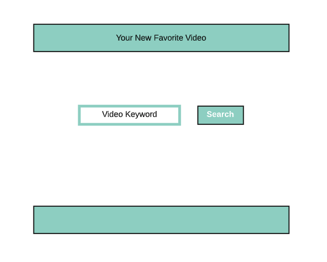
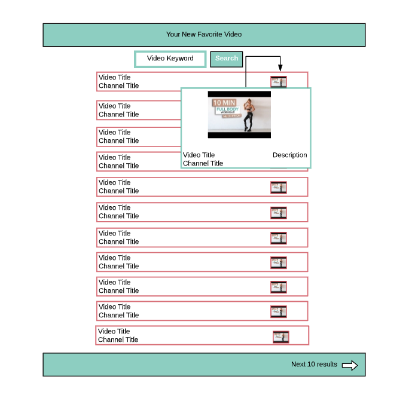
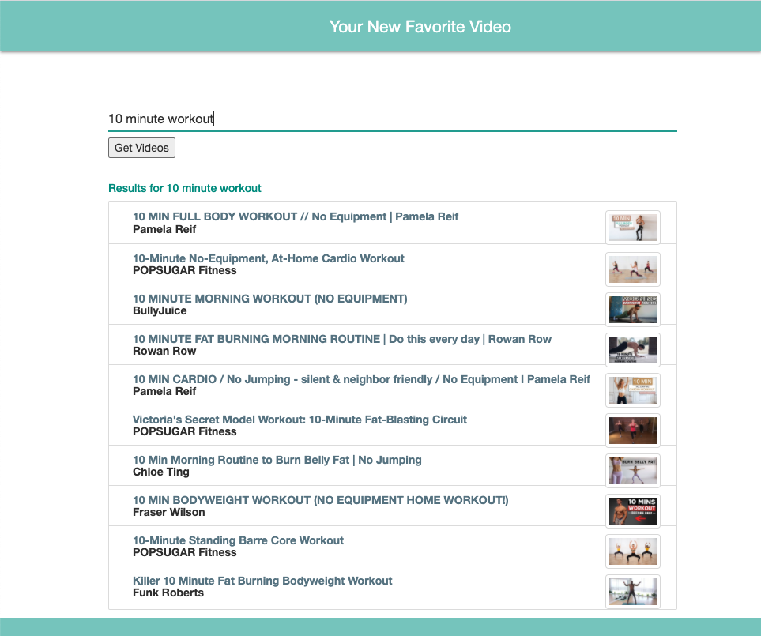
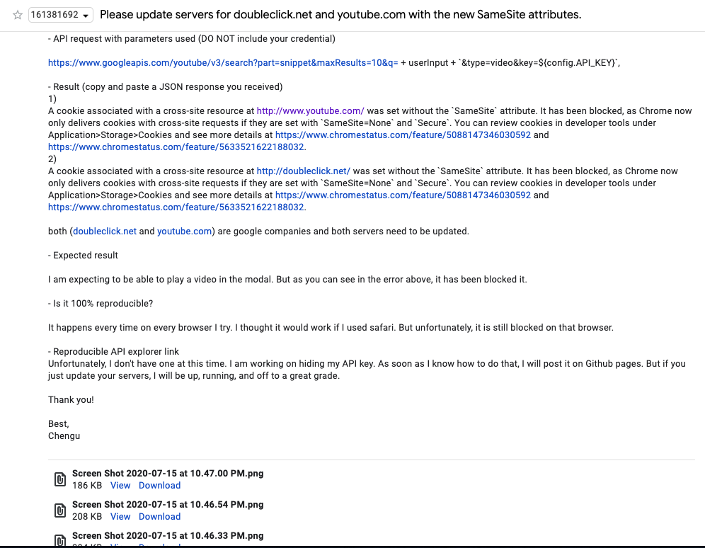

# Your New Favorite Video

I have created an app where you can look for your new favorite video. Using the search bar on top, enter a keyword you would like to search. Hit enter or click "Get Videos" and you will see a list of Youtube videos matching your keyword appear. Click on any of the images and a modal appears with a larger picture of the videos thumbnail with the title, channel name and a description of the video below. You can click the image to open the video in another window or click off the modal to choose a different video. You can also search a different video. Previous searches will kept in local storage to search again if needed.

# Getting Started

To create this app, I used the wireframes (pictured below) as a guide for what I thought was possible in this framework. I laid out my page using Materialize to build the skeleton of the idea.

# Installation Instructions

To install:			
1. Pull the files from [my GitHub Repository](https://github.com/ChenguK/newfavoritevideo)		
2. Open the files in your favorite coding program	
3. Go to the [Youtube Data API v3 site](https://console.developers.google.com/apis/library/youtube.googleapis.com?id=125bab65-cfb6-4f25-9826-4dcc309bc508&project=lunar-sled-283600&authuser=1&supportedpurview=project), Enable the API.		
4. Then click 'Manage' the 'Create Credentials' to create an api for your self.		
5. Once you have it, enter it into the code where I have written ${config.API_Key} js/script.js and run the index.html file in a browser. 	
6. Enjoy!	
7. To test functionality, please read the introductory paragraph of this file for instructions.

# Wireframes

                 

# App Screenshots

# Live Site

[Click here](https://newfavoritevideo.onrender.com/)  to open app in browser.

# Technologies
* HTML    
* CSS     
* JavaScript    	
* Ajax	 
* jQuery      
* Bootstrap    
* Materialize	      
* Youtube Data Api v3

# Unsolved Problems

1. As you can see in the above wireframes, I originally had a different intention for the modals. Originally the video that was attached to each link was supposed to play in the modal. 

However after embedding the videos, I got this warning saying that chrome had changed the way they were addressing and sending cookies everytime. It blocked my ability to play the video in the modal.

I tried to find a way around it by responding to the cookies in my code. But no matter what I did, I kept getting the same response. Through hours of research, I found that I actually couldn't address this issue and only Youtube updating their servers would fix it. So I emailed them as a Hail Mary that maybe they could help.

They responded by saying that it was just a warning and should not keep the video from playing.

I responded by saying that it actually was stopping the video from playing, but that I had already written new code to allow an image in the modal to open the video in a new window so I was fine without it.	

2. As you can see in the above wireframes, I also tried to add a 'next 10 results button.' The intention was for the page to repopulate with the next 10 results from this search. It would require a second Ajax request with a 'nextPageToken' that was renewed by the Youtube API v3 after every search. 

I wrote the code to create this action and ended up with a 'CORS' error. I got this error at the end of the last project day. I would rather have a project that met all requirements with a few extra features and a nice layout, rather than to chase down one more extra feature. I decided that there just wasn't time to figure the error out and worked on making it the nicest looking site I could using Materialize, Bootstrap and CSS.

3. When opening a modal, you can see that the description for the video is on the top section and on the footer. With a little bit more time, I would have been able to figure that out and adjust the code so that all of the description was either on the top section or for the whole modal to be a flat section so all of the elements were on the same plane.

# Future Enhancements

In the future, I would like to do the things I set out to do: 

* Get the video for each link to play in the modal
* Have a working button where the user can repopulate the list with the next 10 results
* To add on: I would like to have a button where the user, having clicked over to the next page of results, can click back to the previous results so they do not have to search for a keyword again to see the first page of results again.
* I would also like to expand the local storage so that the user can click to save each video as they wish to create a playlist that will play within the modal.

# Authors
* Chengusoyane Kargbo - *Initial work* - [ChenguK](https://github.com/ChenguK)

# Acknowledgements
* Thank you to anyone whose code inspired me (all of SEI-R 629) and to all those who helped me create this site.
