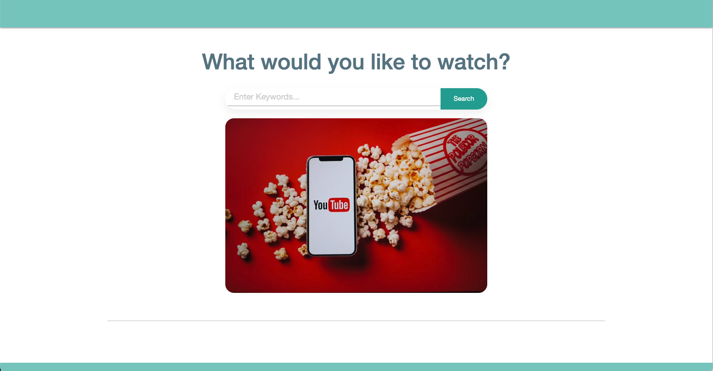
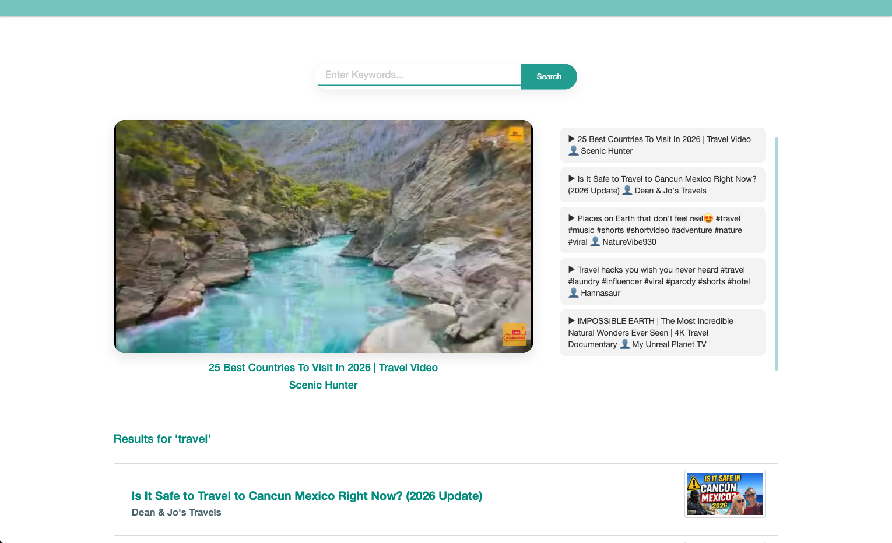

# Your New Favorite Video

A full-stack video search application that helps users discover content through keyword search, preview results, and build a lightweight play history.

This project began as a front-end search experience and evolved into a deployed full-stack application with a backend proxy, improved state management, and refined UI behavior.

🔗 Live App: [link here](https://newfavoritevideo.onrender.com)

🔗 Technical Deep Dive: [TECHNICAL_OVERVIEW.md](https://github.com/ChenguK/newfavoritevideo/blob/master/TECHNICAL_OVERVIEW.md)

## ✨ What It Does

- Search videos by keyword

- View video details in a modal preview

- Click to play selected video in the main player

- Automatically scroll to the top when playback begins

- Maintain a session-based “Recently Played” list

- Responsive layout for desktop and mobile

## 🛠 Tech Stack

- HTML5 / CSS3 (Flexbox)

- JavaScript (ES6)

- Node.js

- Express

- Axios

- YouTube Data API

- Materialize CSS

## 1️⃣ Homepage (Hero + Search) 

## 2️⃣ Search Results State

## 3️⃣ Video Playing + Playlist

## 🚀 Version Evolution

### Version 1 – Front-End Search App

- Client-side API calls

- Modal preview interaction

- Static UI behavior

- No backend or deployment structure

### Version 2 – Full-Stack Deployment Upgrade

- Backend proxy for API security

- Environment variable handling

- Improved layout logic and scroll behavior

- Session-based history instead of persistent storage

- Deployment-ready structure with dependencies managed

## Future Improvements

- Refactor state logic for scalability

- Add loading indicators and error handling improvements

- Improve accessibility and keyboard navigation

- Expand filtering/sorting options

## Authors
* Chengusoyane Kargbo - [GitHub Profile](https://github.com/ChenguK) - [Email](mailto:ChenguKargbo@gmail.com)
